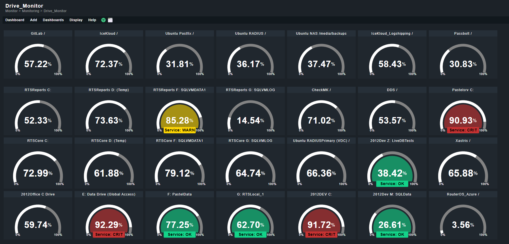

Just a Repo to show off the checkMK setup at work, without giving up company secrets :)

## RTS Control Room Dashboard

This dashboard provides a variety of Realcontrol related information. A lot of it is based on custom SQL queries

## Drive_Monitor Dashboard

This dashboard is a "at a glance" monitor for our production server hard drives.

## Ad Hoc Product Monitor

This was originally going to be a place to stick things that couldn't fit on the Control Room dashboard, but was converted into a Qsmacker monitor. Also based on custom SQL queries. It tracks total open batches, total open commands, and both those metrics over time.

## RTS_Servers_Dash

This dash is just a combination of CPU usage with added disk I/O on our SQL servers
